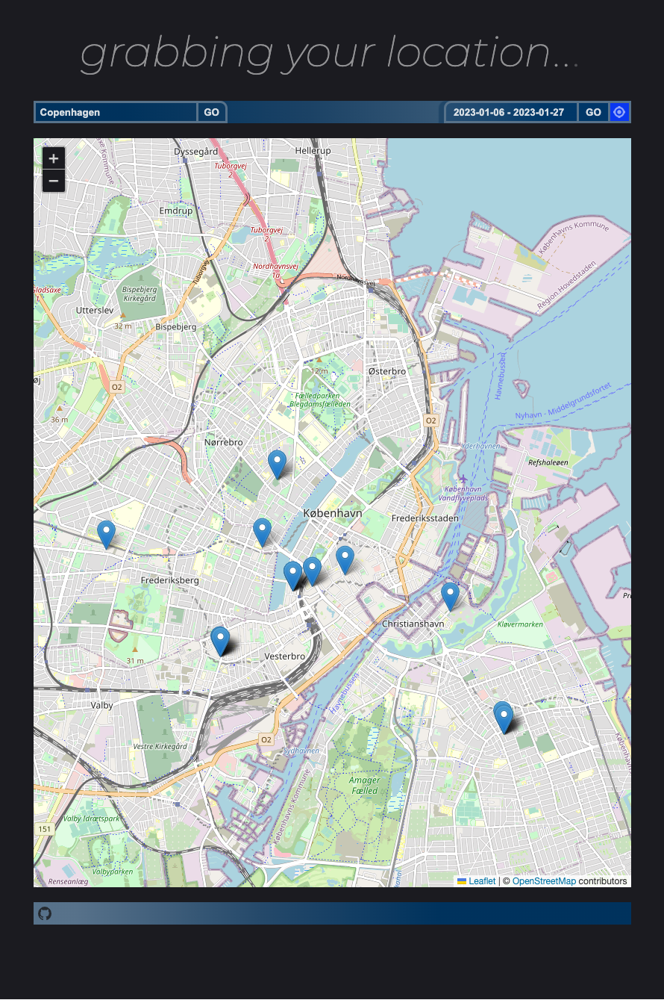
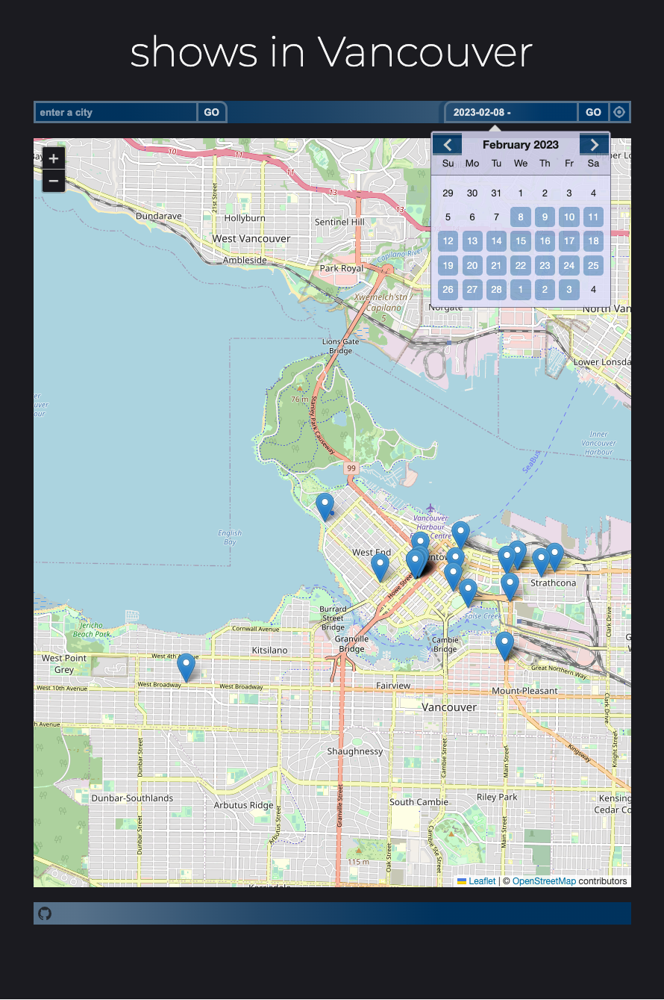
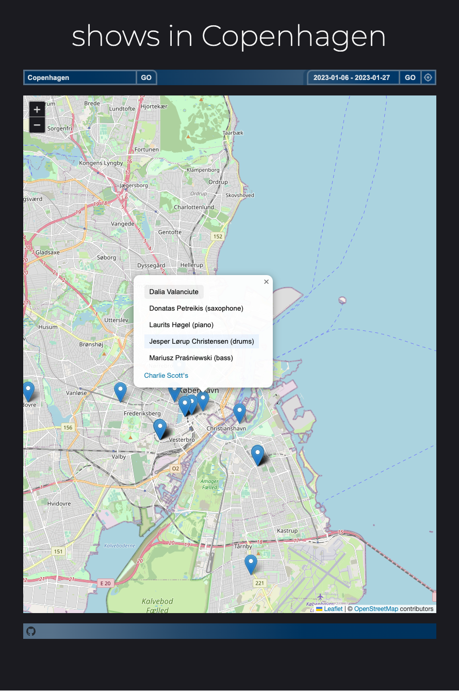
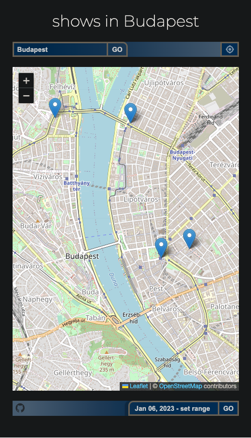

# ShowFinder

Simple SPA to find local shows surrounding the user. Maps nearby concerts and gives complete information regarding artists, track previews, venues and showtimes. Focusing on ease-of-use in a clean interface. 

## It's Live -- Go Find Shows!:
https://www.showfinder.ninja/

- backend deployed with Render
- frontend with AWS Amplify

## Features:

- Current shows dates with link to venues, artists and tickets
- artist top track audio preview
- Specify any city and date range
- event-list drawer for easy lookup
- fully responsive

## Stack:

- React.js
- React Leaflet
- Node.js
- Express

## APIs:

### utilizes free APIs!
- LocationIQ: forward and reverse geocoding
- RapidAPI: artists events tracker by location
- SpotifyAPI: audio samples
- tried: PredictHQ, Songkick, Zyla
 

### Developed & Designed by Spencer Cole

