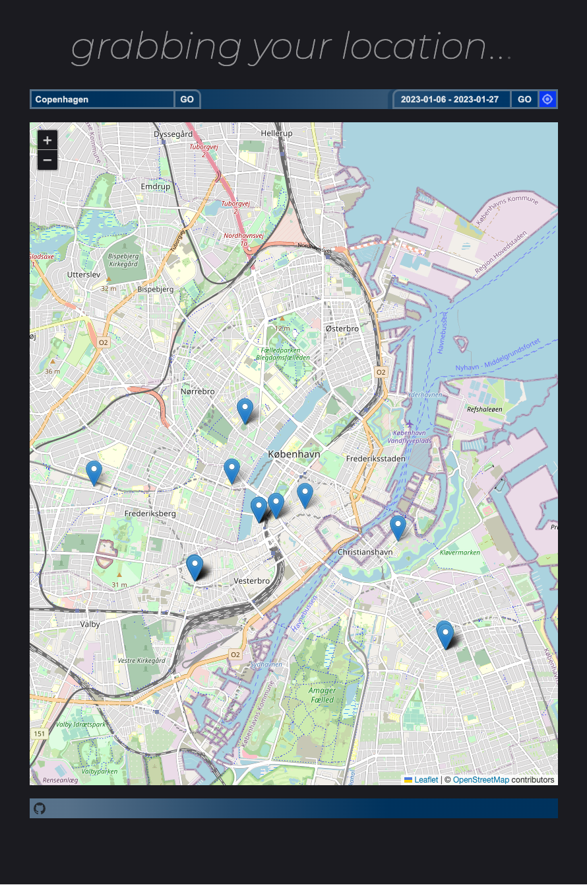
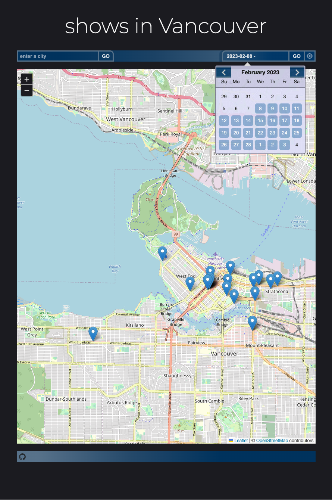
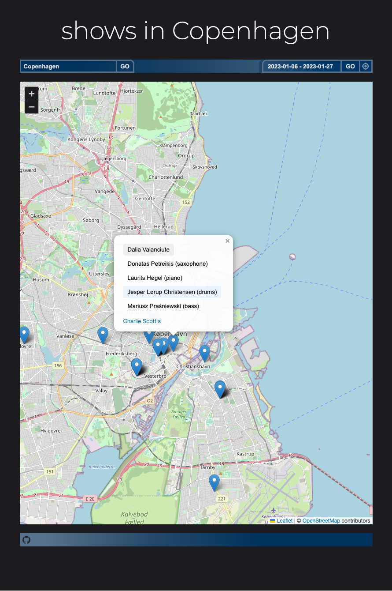
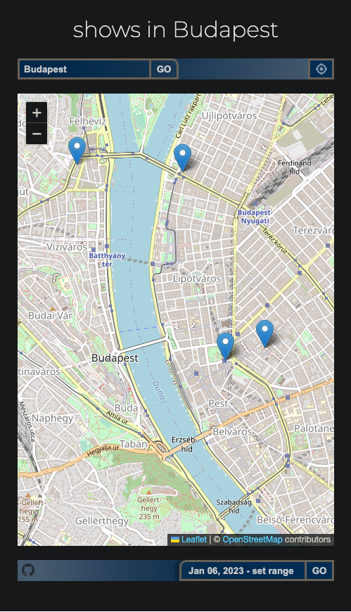

# ShowFinder

Simple SPA to find local shows surrounding the user. Maps nearby concerts and gives complete information regarding artists, track previews, venues and showtimes. Focusing on ease-of-use in a clean interface.

## It's Live -- Go Find Shows!:

https://www.showfinder.ninja/

- Backend deployed with Render
- Frontend with AWS Amplify

## Features:

- Current shows dates with link to venues, artists and tickets
- Audio preview of artist top track
- Specify any city and date range (up to a 14-day window)
- Event-list drawer for easy lookup
- Fully responsive

## Stack:

- React.js
- React Leaflet
- Node.js
- Express
- TypeScript (server, strict) + ESM

## APIs:

### utilizes free APIs!

- LocationIQ: forward and reverse geocoding
- RapidAPI: artists events tracker by location
- Ticketmaster Discovery: second event source, merged with RapidAPI
- Spotify API: artist track previews and links to artist pages
- tried: PredictHQ, Songkick, Zyla
   

Two event sources are queried in parallel and merged so the same concert never
appears twice. The feeds share no event id, so events are matched on venue plus
start time, or artist plus date, whichever agrees first
(`server/src/utils/mergeShows.js`). Ticketmaster is optional: without its key the
API still returns RapidAPI results.

When the two sources spell one act differently, the alternate spelling is kept on
the performer as an `alias`. The server resolves artists against Spotify itself
(`server/src/services/spotify.js`) and uses those aliases, because a plain artist
name resolves where a ticketing tour title does not; an act it cannot identify
confidently gets no link rather than a link to the wrong artist.

Server setup requires `IQ_TOKEN` and `RAPID_KEY`, plus (for audio previews)
`CLIENT_ID` / `CLIENT_SECRET` — see `server/.env.example`. After deploying,
`GET /api/health` reports which keys are configured (booleans only, never values)
and returns 503 if a required key is missing.

### Developed & Designed by Spencer Cole

